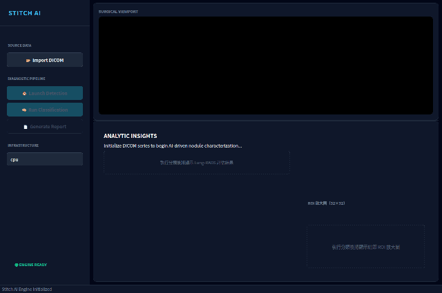

# 肺結節良惡性輔助診斷系統 (Lung Nodule Detection & Malignancy Classification)

淡江大學資訊工程系專題研究成果。結合 YOLO 物件偵測與雙路徑 CNN 多任務分類，輔助放射科醫師判讀肺結節良惡性，並依 Lung-RADS 分級提出後續處置建議。

> 📌 此版本（v2.0）基於 LIDC-IDRI 公開資料集，於 51 病患 holdout test split 上達成 **100% 惡性結節召回**（Bootstrap 95% CI [1.0, 1.0]）與 **5.4% 良性誤判率**。
>
> 📄 **完整收官報告：[PROJECT_SUMMARY.md](PROJECT_SUMMARY.md)**（架構、KPI、消融實驗、合規驗證、未來工作）

---

## 🎬 系統演示

> 完整 4 步驟診斷流程：載入 CT → AI 偵測 → 分類 → Lung-RADS 報告



---

## 📊 模型效能（51 patient holdout, seed=42）

| 指標 | 數值 | 95% Bootstrap CI |
| :--- | :--- | :--- |
| **惡性結節召回 (E2E)** | **100%** (33/33) | [1.000, 1.000] |
| **良性誤判率 (B→M FP)** | 5.4% (2/37) | [0.000, 0.135] |
| **F1 分數** | **0.971** | [0.925, 1.000] |
| YOLO 偵測召回 | 97.1% | — |
| CNN AUC (AttFB) | **0.997** | — |

> 1000 次 Bootstrap 重採樣中**每一次都守住 100% 惡性召回**——signal 是真的，不是小樣本運氣。

---

## 🏗️ 系統架構

```
┌────────────── Stage 1: YOLO 結節偵測 ─────────────┐
│   YOLO11n (2.6M params) + LIDC fine-tune          │
│   conf threshold 0.05, min box 5px                │
│   每片切片 → 候選框 list                          │
└──────────────────────┬─────────────────────────────┘
                       │
┌────────────── 3D Nodule Grouping ─────────────────┐
│   連續 slice 偵測框 → 聚為 3D nodule group        │
│   group_gap=1, min length 2                       │
└──────────────────────┬─────────────────────────────┘
                       │
┌────────── Stage 2: CNN 良惡性分類 ────────────────┐
│   NoduleClassifier (CBAM + Attribute Feedback)    │
│   雙輸入: ROI 64×64 + Context 128×128             │
│   輔助任務: lobulation, spiculation, margin       │
│   每片切片 → softmax(benign, malignant)           │
└──────────────────────┬─────────────────────────────┘
                       │
┌────────── 3D Aggregation (Gaussian) ──────────────┐
│   sigma = n_slices / 6, center = mid              │
│   nodule mal_prob = Σ slice × normalized weight   │
└──────────────────────┬─────────────────────────────┘
                       │
┌──────── Lung-RADS 臨床分級 + 處置建議 ─────────────┐
│   < 0.01 → 2  良性, 年度追蹤                       │
│   < 0.05 → 3  低度懷疑, 6 月追蹤                   │
│   < 0.15 → 4A 中度懷疑, 3 月追蹤                   │
│   < 0.50 → 4B 高度懷疑, PET-CT/切片                │
│   ≥ 0.50 → 4X 高度惡性, 立即會診胸腔外科           │
└────────────────────────────────────────────────────┘
```

---

## 🔬 關鍵技術

### Attribute Feedback (JIMI 2022)
輔助任務（lobulation/spiculation/margin）的預測值反饋進惡性分類頭，提供臨床語義線索。

### 3D Gaussian-weighted Slice Aggregation
單張 slice 推理 → 中心加權聚合，避免邊緣 slice 噪聲。實測將 B→M FP 從 13.5%（單片）降至 5.4%（聚合）。

### CBAM Residual Attention
Channel + Spatial 注意力雙路，結合 ResNet-style 殘差連接。

---

## 🧪 消融實驗（Ablation）

| 變體 | Test AUC | 部署狀態 |
|:---|:---:|:---:|
| 1ch baseline (multi-task only) | 0.984 | — |
| **1ch + AttFB + 3D Gaussian agg** | **0.997** | ✅ **Production** |
| 2.5D (3 adjacent slices stacked) + AttFB | 0.992-0.995 | ⚠️ 備查（沒贏，未部署） |
| YOLO V3 (with hard negatives) | F1 0.813（單模） | ⚠️ 備查（pipeline 沒贏 V2） |

**關鍵發現:** 多視角資訊在「**推理端做 3D Gaussian 聚合**」比「輸入端做 2.5D stacking」更有效。
這也是為什麼 future work 要走真 3D + 多中心資料（LUNA16），不是只改通道數。

---

## 🖥️ 執行環境

### 必要套件
```bash
pip install ultralytics pydicom PyQt5 torch torchvision opencv-python numpy reportlab
pip install pylidc tcia_utils  # 訓練流程需要
```

### 啟動 GUI（已有 model 權重）
```bash
# models/ 目錄需要：
#   - best.pt                       (YOLO11n LIDC fine-tuned)
#   - dual_input_final_model.pth    (CNN AttFB)

python -m gui_app.main_window
```

### 醫師使用流程
1. 點 **「Import Study Folder」** 選擇病患 study 資料夾（自動掃描 .dcm/.png）
2. 點 **「Launch Detection」** 執行 YOLO 結節偵測
3. 點 **「Run Classification」** 執行 CNN 良惡性分類 + Lung-RADS 分級
4. 點 **「Generate Report」** 一鍵生成 PDF 診斷報告（含截圖、KPI、行動建議）

---

## 🛠️ 從零訓練 (Train from Scratch)

> Repo 不附 model 權重——下面是完整可重現的訓練流程，從 LIDC-IDRI 公開資料到 GUI 可運行的模型。

### 步驟 1: 下載 LIDC-IDRI DICOM（分批，省磁碟）

LIDC-IDRI 全套 ~125 GB。`batch_pipeline.sh` 會「下一批 → 處理 → 刪 DICOM」反覆，磁碟峰值只佔當批 ~13 GB。

```bash
# 一次下 100 人，處理完即刪 DICOM，只留 PNG slice
bash scripts/batch_pipeline.sh 1 100
bash scripts/batch_pipeline.sh 101 200
# ... 共 1018 病人，但 331 已足夠跑出 100% recall
```

每批產出: `/home/lbw/project/LIDC-IDRI/nodules_hires/LIDC-IDRI-XXXX/nodule-N/{ctx,roi}/slice-NNN.png`

### 步驟 2: 整合多任務標籤 CSV

```bash
python3 classification_cnn/build_lidc_dataset.py \
    --dicom_dir /path/to/LIDC-IDRI/DICOM_organized \
    --out_dir /home/lbw/project/LIDC-IDRI/nodules_hires
```

產出 `labels_multitask.csv`（roi_path, ctx_path, malignancy_avg, label, lobulation, spiculation, margin, ...）。

### 步驟 3: 訓練 CNN (AttFeedback, 推薦)

```bash
python3 classification_cnn/train_attfeedback.py \
    --csv /home/lbw/project/LIDC-IDRI/nodules_hires/labels_multitask.csv \
    --epochs 60 --batch 16 --device cuda
```

- 自動 patient-level 70/15/15 split (seed=42)
- 同時訓練 malignancy + 3 個 aux head (lobulation/spiculation/margin)
- Aux 預測值反饋進 malignancy head（JIMI 2022）
- 輸出: `models/dual_input_final_model.pth`（含完整 state_dict 含 aux + malignancy heads）
- 預期 test AUC ≈ 0.997

### 步驟 4: 構建 YOLO 訓練資料集

```bash
# V2: 純正向（已驗證為生產最優）
python3 detection_yolo/build_lidc_yolo.py
# → /home/lbw/project/LIDC-IDRI/yolo_lidc/

# V3 (備選): 加 hard negatives（synthetic test 上 F1 更高，
# 但生產 pipeline 上 B→M FP 比 V2 高，故未上線）
python3 detection_yolo/build_lidc_yolo_v3.py
```

### 步驟 5: 訓練 YOLO

```bash
yolo detect train \
    data=/home/lbw/project/LIDC-IDRI/yolo_lidc/data.yaml \
    model=yolo11n.pt \
    epochs=50 imgsz=256 batch=64 patience=0 \
    device=0 project=detection_yolo/runs name=lidc_v2
```

訓練完: `detection_yolo/runs/lidc_v2/weights/best.pt` → 複製到 `models/best.pt`

### 步驟 6: 跑 GUI 驗證

```bash
python -m gui_app.main_window
```

選任意 LIDC 病患資料夾 → 點 Detection → 點 Classification → 看 Lung-RADS 卡。

---

### ⏱️ 預估時間（單張 RTX 2080 Ti）
| 步驟 | 時間 | 磁碟占用 |
| :--- | :--- | :--- |
| 1. 下載 + 預處理 (1018 人，建議只跑 331) | 4-8 小時 | 峰值 13 GB / 沉澱 300 MB |
| 2. CSV 標籤整合 | 5 分鐘 | + 30 MB |
| 3. CNN 訓練 (60 epochs) | 30 分鐘 | + 10 MB |
| 4. YOLO dataset build | 5 分鐘 | + 100 MB |
| 5. YOLO 訓練 (50 epochs) | 6 分鐘 | + 5 MB |
| **總計** | **5-9 小時** | **~500 MB** |

---

## 📂 專案結構

```
Lung_Nodule_System/
├── gui_app/                       # PyQt5 演示界面
│   ├── main_window.py                ← 主窗口
│   ├── predictor.py                  ← 推理流水線（YOLO + CNN + 3D agg）
│   ├── nodule_classifier.py          ← CNN 模型架構
│   ├── model_manager.py              ← 模型載入 + auto-detect
│   ├── image_viewer.py               ← CT viewport
│   ├── lung_rads_card.py             ← Lung-RADS 色塊卡 (v2.0 新增)
│   └── pdf_report.py                 ← PDF 診斷報告 (v2.0 新增)
├── classification_cnn/            # CNN 訓練 + 資料管線
│   └── train_attfeedback.py          ← 主訓練腳本
├── detection_yolo/                # YOLO 訓練
│   ├── build_lidc_yolo.py            (V2 dataset)
│   └── build_lidc_yolo_v3.py         (V3 with hard negatives)
├── models/                        # 部署模型
│   ├── best.pt                       (YOLO11n V2)
│   └── dual_input_final_model.pth    (AttFB CNN)
└── output/                        # PDF 報告輸出
```

---

## ✅ 資料合規

- 訓練/驗證/測試 split 為 **patient-level**（同一病患所有切片屬於同一 split）
- Random seed 固定為 42，YOLO 與 CNN 使用**完全相同的 split**
- Test set 51 病患從未被任何模型在訓練或驗證階段見過
- 所有 KPI 報告皆基於 holdout test set，符合機器學習評估規範

---

## 🚧 未來工作

1. **真 3D CNN（3D ResNet）** — 對 <6mm 微小結節判讀有提升空間，需要重建 DICOM 體素資料
2. **外部資料集驗證 (LUNA16 / NLST)** — 證明跨資料集泛化
3. **GUI Threshold Slider** — 醫師現場調整敏感度 vs 特異度
4. **DICOM SR 結構化報告 + HL7 FHIR** — 對接醫院 PACS 系統

---

## 👥 研究團隊
- **指導老師**：淡江大學資訊工程系 教授
- **組員**：陳威丞、廖柏維、鍾翔宇、江昊宸

---

*本系統為 AI 輔助診斷工具，最終診斷需由放射科醫師判讀。*
