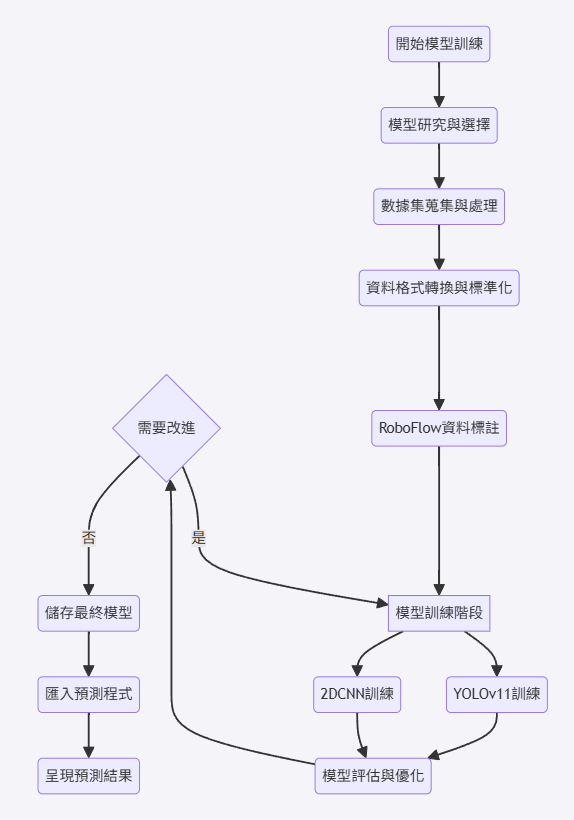
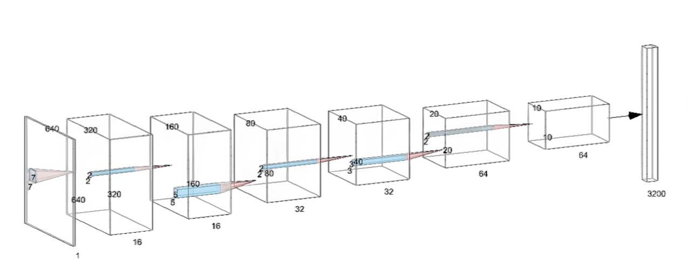
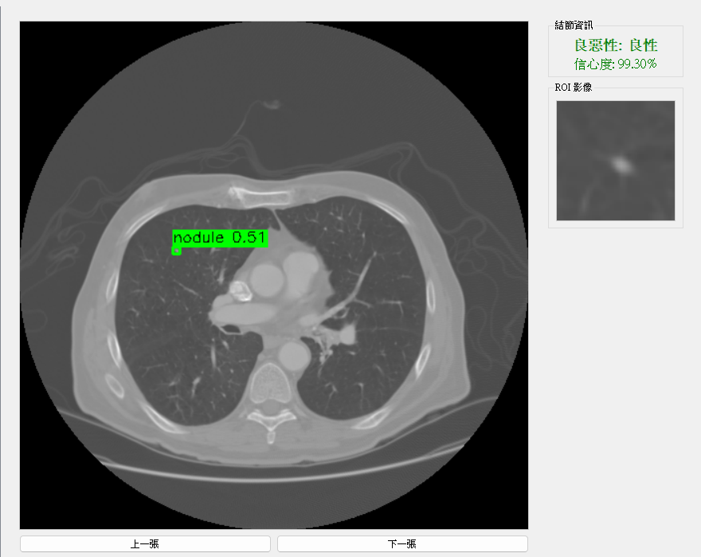

# 肺結節良惡性輔助診斷系統 (Lung Nodule Detection & Malignancy Classification)

本專案為淡江大學資訊工程系專題研究成果，開發一套結合深度學習物件偵測與多尺度特徵提取分類技術的醫療影像輔助系統。

## 📊 系統架構與流程

### 專題流程圖


### 雙路徑特徵融合模型 (Dual Input CNN)
模型同時分析結節局部 (ROI) 與全局上下文 (Full CT) 資訊，以達到更高精度的分類。

*(圖：Full CT 路徑與 ROI 路徑示意圖)*

## 🖥️ 系統介面呈現

*(系統可自動標註結節位置，並即時預測良惡性程度與信心度)*

## 📈 模型效能評估
本研究對比了「簡易 CNN」與「雙輸入 CNN」的表現，結果顯示雙輸入架構在各項指標上均有顯著提升：

| 評估指標 | 簡易 CNN 模型 | 雙輸入模型 (本專案) | 提升幅度 |
| :--- | :--- | :--- | :--- |
| **準確率 (Accuracy)** | 84.30% | **94.70%** | **+10.40%** |
| **召回率 (Recall)** | 89.52% | **94.70%** | +5.18% |
| **特異度 (Specificity)** | 78.61% | **94.60%** | +15.99% |
| **AUC 值** | 0.919 | **0.984** | +7.07% |
| **假陽性 (FP)** | 172 例 | **38 例** | **-77.90%** |
| **假陰性 (FN)** | 92 例 | **50 例** | -45.70% |

---
## 🚀 執行環境

### 必要套件
```bash
pip install ultralytics pydicom PyQt5 torch torchvision opencv-python numpy
```

### 啟動系統
1. 請確保將訓練好的 `best.pt` 與 `dual_input_final_model.pth` 放入 `models/` 目錄或指定路徑。
2. 執行主程式：
```bash
python gui_app/cnn_detector_v1.py
```

## 📊 研究成果
- **偵測準確率 (mAP@0.5)**: 0.88+
- **分類準確率 (Accuracy)**: 94.7%
- **分類召回率 (Recall)**: 94.7%

## 👥 研究團隊
- **指導老師**：淡江大學資訊工程系 教授
- **組員**：陳威丞、廖柏維、鍾翔宇、江昊宸

---
*本系統僅供研究與輔助參考用途，臨床診斷請以專業醫師判斷為準。*
